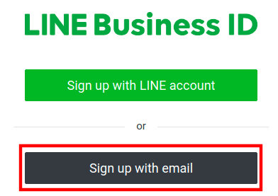
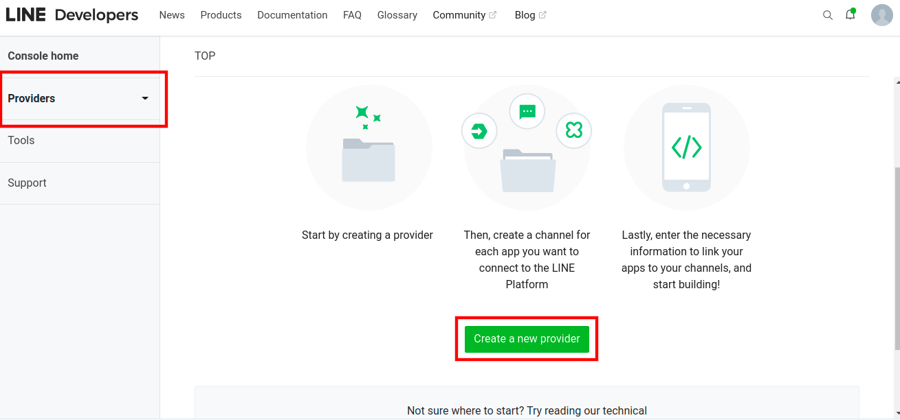
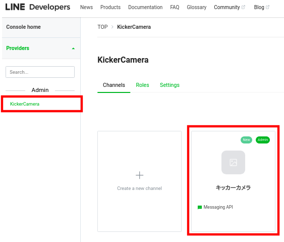
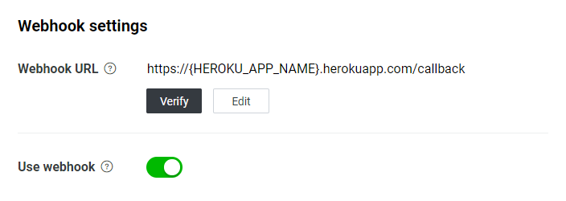

# キッカーカメラ

スキー場のパークで練習時に「自分の滑りを動画で見返したい」、という思いから始めたプロジェクトです。

キッカーを飛ぶ直前にLINEアプリから録画をスタートする事で、ゲレンデに設置されたカメラからの動画を飛んだ直後にLINEのメッセージで動画が送られてくる仕組みです。

## LINE使用流れ

## 動画例（Hakuba47）

## 必要な機材
1. スマートフォン\
    iPhone・Androidでの動作を確認済み
2. 三脚\
    スマホが固定出来る三脚が必要です。持ってない場合は[Amazonの安価スマホ三脚](https://www.amazon.co.jp/gp/product/B07PVNBL74/)がオススメ。
3. simカード\
    アップロード速度の早いsimが必須。また、アップロード速度はカメラを設置する場所の電波と関係しているので、simプランを組む前に、キャリアを試したい場合はプリペイドsimで試した方が良い。[AmazonのSoftbank10GBデータsim](https://www.amazon.co.jp/gp/product/B07SG23VMN/)がオススメ。

# セットアップ手順

セットアップは少し手間がかかります。

1. [Gmail アカウントを作成](#Gmail-アカウントを作成)
1. [Twitch アカウントを作成](#Twitch-アカウントを作成)
1. [LINE Developers アカウントを作成](#LINE-Developers-アカウントを作成)
1. [チャンネルシークレットとチャンネルトークンの取得](#チャンネルシークレットとチャンネルトークンの取得)
1. [Heroku デプロイする](#Heroku-デプロイする)
1. [LINEでWebhook URLを設定する](#LINEでWebhook-URLを設定する)

## Gmail アカウントを作成

カメラ用の新しいメールアカウントを作成する事をオススメします。

## Twitch アカウントを作成

[Twitch Sign Up](https://www.twitch.tv/signup) からアカウントを無料で作成します。メールアドレスは先程作成したアカウントを使用します。

## LINE Developers アカウントを作成

[LINE Businessサインイン画面](https://account.line.biz/signup)から [**Sign up with email**] を選択して、メールアドレスからLine Businessのアカウントを作る。

サインアップが終わり、LineDevelopersページにログイン出来たらProvidersタブを開き **Create a new provider** を押す。

プロバイダー名は何でも良いです、以下のようにKickerCameraで問題ありません。

**Create a Messaging API channel** を選択します。

チャンネル名を**キッカーカメラ**にし、CategoryとSubcategoryは適当に選択して、チャンネルを作成します。

## チャンネルシークレットとチャンネルトークンの取得

[チャンネル基本設定]タブの**チャンネルシークレット**は後で使うので、メモアプリ等に控えておきます。\
[Messaging API設定]タブの**チャンネルアクセストークン**を発行します。後で使うので控えておきます。

## Heroku デプロイする

上の**Deploy to Heroku**をクリックして、アカウントを作成します。

次に出てきた画面にアプリ名（例：hakuba-47-kicker-camera-1)を入力し、
先ほど控えておいた以下を入力して、サーバーを作成します。
* ラインチャンネルシークレット
* ラインチャンネルトークン
* Twitch ユーザー名

## LINEでWebhook URLを設定する

LINE Developersに戻り、
LINE Developersコンソールで、Messaging APIチャネルの［Messaging API設定］タブをクリックします。

「https://{HEROKU_APP_NAME}.herokuapp.com/callback」というURL形式で、Webhook URLを入力します。

例：アプリ名が「kicker-camera-test-1」の場合、Webhook URLは `https://kicker-camera-test-1.herokuapp.com/callback` になる。

[**Webhookの利用**］を有効にします。